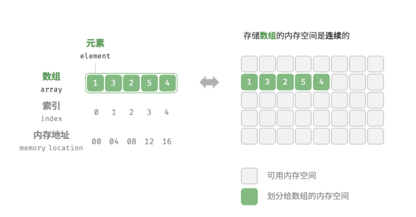

# 数组(Array)



- 访问元素

  ```py
  import random
  
  def random_access(num:list[int]) -> int:
      """随机访问数组里的元素并且返回"""
      random_index = random.randint(0, len(num) - 1)
      random_number = num[random_index]
      return random_number
  
  test = [1, 2, 3, 4, 5]
  print(random_access(test))
  ```

  ```c++
  int random_access(int *num, int size)
  {
  int random_index = rand() % size;//随机数对数组长度取余，得到数组长度的随机数
  int random_number = num[random_index];
  return random_number;
  }
  
  int main()
  {
      std::srand(std::time(0)); // 用当前时间作为随机数种子（rand函数在使用前需要指定随机数种子，通常用当前时间）
      int test[] = {1, 2, 3, 4, 5};
      std::cout << random_access(test, 5) << std::endl;
  }
  ```

- 插入元素

  ```py
  def insert(nums: list[int], num: int, index: int):
      """在数组的索引 index 处插入元素 num"""
      nums.append(0)  # 先在数组末尾添加一个元素以扩展数组长度
      for i in range(len(nums) - 1,index,-1):
          nums[i] = nums[i - 1]
      nums[index] = num
  
  test = [1, 2, 3, 4, 0, 0]
  insert(test, 80, 2)
  print(test)
  ```

  ```c++
  int main()
  {
      std::vector<int> test = {1, 2, 3, 4, 5};
      test.insert(test.begin()+4, 6);
      for(int i=0;i<6;i++)
      {
          std::cout<<test[i]<<" ";
      }
  }
  ```

  >vector的insert用法：
  >
  >- 插入一个元素
  >
  >  `v.insert(v.begin() + 2, 99);`
  >
  >- 插入多个相同元素
  >
  >  `v.insert(v.begin() + 1, 3, 7);`
  >
  >- 插入另一个容器的一段（范围插入）
  >
  >  `a.insert(a.begin() + 1, b.begin(), b.end());`
  >
  >- 插入初始化列表
  >
  >  `v.insert(v.begin() + 2, {100, 101, 102});`

- 删除一个元素

  ```py
  def remove(nums: list[int], index: int):
      """删除索引 index 处的元素"""
      if index < 0 or index >= len(nums):
          raise IndexError("index out of range")
      # 把索引 index 之后的所有元素向前移动一位
      for i in range(index,len(nums)-1):
          nums[i]=nums[i+1]
      nums.pop
  
  test = [1,2,3,4,5,6,7,8]
  remove(test,10)
  print(test)
  ```

  ```python
  def remove(nums: list[int], index: int):
      nums.pop(index)	#用pop更方便
  
  test = [1,2,3,4,5,6,7,8]
  remove(test,3)
  print(test)
  ```

  ```c++
  /* 删除索引 index 处的元素 */
  void remove(int *nums, int size, int index) {
      // 把索引 index 之后的所有元素向前移动一位
      for(int i = index;i < size-1;i++)
      {
          nums[i] = nums[i+1];
      }
  
  }
  
  int main()
  {
      std::vector<int> test = {1,2,3,4,5,6,7};
      int size = test.size();
      remove(test.data(),size,4);
      size--; //逻辑删除，并没有真正的从数组里删除
      for(int i = 0;i<=size-1;i++)
      {
          std::cout<<test[i]<<" ";
      }
      
  }
  ```

  > vector里的删除元素的方法：
  >
  > `test.erase(test.begin() + index);`


- 查找元素

  ```py
  #查找元素
  def find(nums: list[int], target: int) -> int:
      """在数组中查找指定元素"""
      for i in range(0,len(nums)-1):
          if nums[i] == target:
              print(i)
  
  test = [1,2,3,4,5,6,7,8,9]
  find(test,9)
  ```

  ```c++
  void find(const std::vector<int>& nums,int target,int size)
  {
      for(int i = 0;i <= size-1;i++ )
      {
          if(nums[i] == target)
          {
              std::cout<<i;
          }
      }
  }
  
  int main()
  {
      std::vector<int> test = {1,2,3,4,5,6,7,8,9};
      find(test,9,9);
  }
  ```

  > python中print函数的`f-string`（格式化字符串字面量）用法(在字符串前加 `f`，然后在 `{}` 里写表达式)
  >
  > - 最基础用法：变量替换
  >
  >   >name = "张三"
  >   >age = 20
  >   >print(f"我叫{name}，今年{age}岁")
  >
  > - `{}` 里可以写“表达式”，不只是变量
  >
  >   >a = 3
  >   >b = 5
  >   >print(f"{a}+{b}={a+b}")
  >   >print(f"平方：{a**2}")
  >   >print(f"是否大于：{a > b}")
  >
  > - 控制小数位 / 百分比 / 科学计数法
  >
  >   - 保留 2 位小数
  >
  >     >pi = 3.1415926
  >     >print(f"{pi:.2f}")   # 3.14
  >
  >   - 百分比显示
  >
  >     >rate = 0.12345
  >     >print(f"{rate:.1%}")  # 12.3%
  >
  >   - 科学计数法
  >
  >     >x = 1234567
  >     >print(f"{x:.2e}")  # 1.23e+06
  >
  > - 对齐与宽度（做表格输出很常用）
  >
  >   >name = "Tom"
  >   >score = 95
  >   >print(f"{name:>10} {score:>5}")  # 右对齐
  >   >print(f"{name:<10} {score:<5}")  # 左对齐
  >   >print(f"{name:^10} {score:^5}")  # 居中
  >
  > - 整数格式：补零、千分位
  >
  >   - 补零
  >
  >     >n = 7
  >     >print(f"{n:03d}")  # 007
  >
  >   - 千分位
  >
  >     >money = 123456789
  >     >print(f"{money:,}")  # 123,456,789
  >
  > - 打印“调试信息”特别好用：`=`
  >
  >   >x = 10
  >   >y = 3
  >   >print(f"{x=}, {y=}, {x+y=}")
  >
  > - 多行 f-string
  >
  >   >name = "张雷"
  >   >score = 95
  >   >msg = f"""
  >   >姓名：{name}
  >   >分数：{score}
  >   >"""
  >   >print(msg)
  >
  > - 用 f-string 调用对象的属性 / 字典
  >
  >   - 对象的属性
  >
  >     >class A:
  >     >    def __init__(self): self.x = 5
  >     >a = A()
  >     >print(f"{a.x}")
  >
  >   - 字典
  >
  >     >d = {"name": "张雷", "age": 20}
  >     >print(f"{d['name']} {d['age']}")
