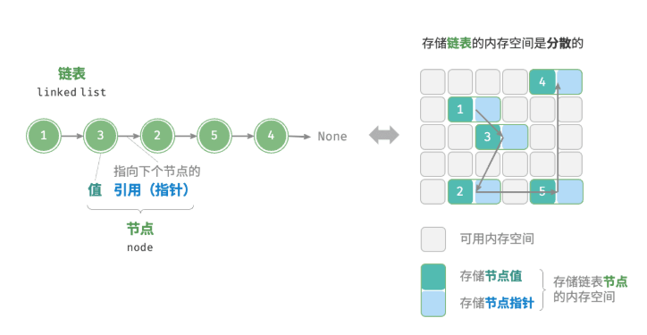
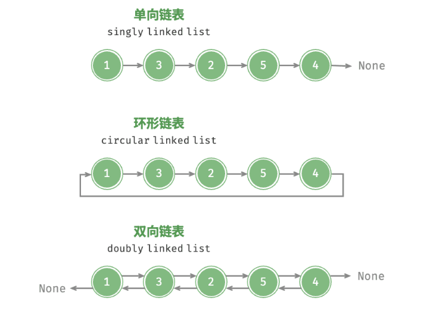

# 链表（Linked_List）



- 创建节点

  ```python
  class ListNode:
      """链表节点类"""
      def _init_(self,val : int):
          self.val = val
          self.next:ListNode|None = None #python中可以随时随地给对象赋新的属性
  ```

  ```c++
  struct ListNode
  {
      int val;
      ListNode *next;
      ListNode(int x):val(x),next(nullptr) {}
  };
  ```

- 访问节点

  ```python
  def access(head: ListNode, index: int) -> ListNode | None:
      """访问链表中索引为 index 的节点"""
      for _ in range(index):
          if head.next == None:
              return None
          head = head.next
      return head
  ```

  ```c++
  ListNode *access(ListNode *head,int index)
  {
      for(int i=0;i<=index;i++)
      {
          if(head->next==nullptr)
          {
              return nullptr;
          }
          head = head->next;
      }
      return head;
  }
  ```

- 查找节点

  ```python
  def find(head: ListNode, target: int) -> int:
      """在链表中查找值为 target 的首个节点"""
      while head: #只要head的值不是None就一直循环
          index = 0
          if head.val == target:
              return index
          head = head.next
          index += 1
      return -1
  ```

  ```c++
  int find(ListNode *head, int target) {
      int index = 0;
      while (head != nullptr) {
          if (head->val == target)
              return index;
          head = head->next;
          index++;
      }
      return -1;
  }
  ```

- 双向链表

  

  ```python
  class ListNode:
      """双向链表节点类"""
      def __init__(self, val: int):
          self.val: int = val                # 节点值
          self.next: ListNode | None = None  # 指向后继节点的引用
          self.prev: ListNode | None = None  # 指向前驱节点的引用
  ```

  ```c++
  struct ListNode {
      int val;         // 节点值
      ListNode *next;  // 指向后继节点的指针
      ListNode *prev;  // 指向前驱节点的指针
      ListNode(int x) : val(x), next(nullptr), prev(nullptr) {}  // 构造函数
  };
  ```

  

